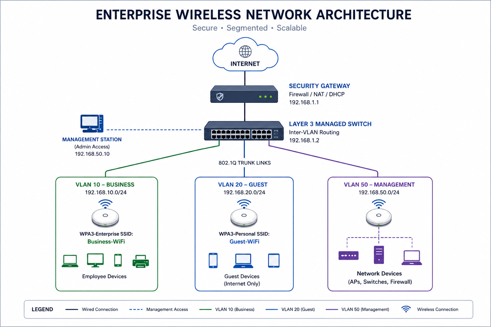
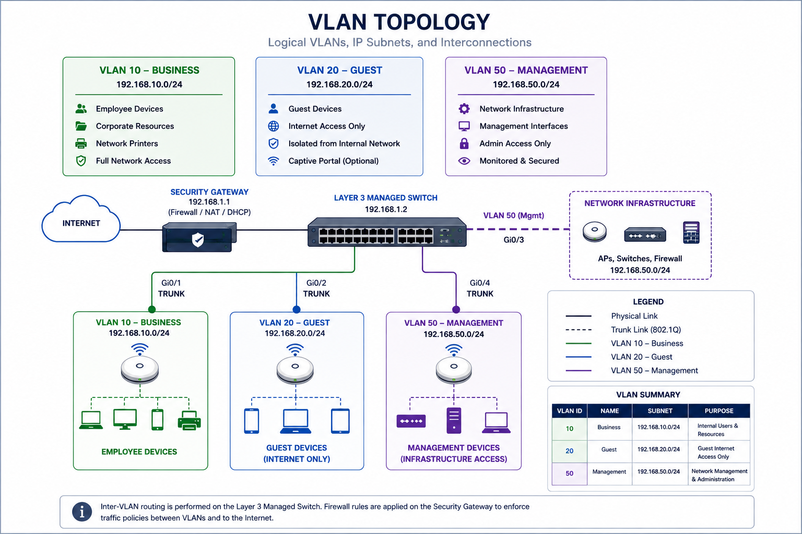
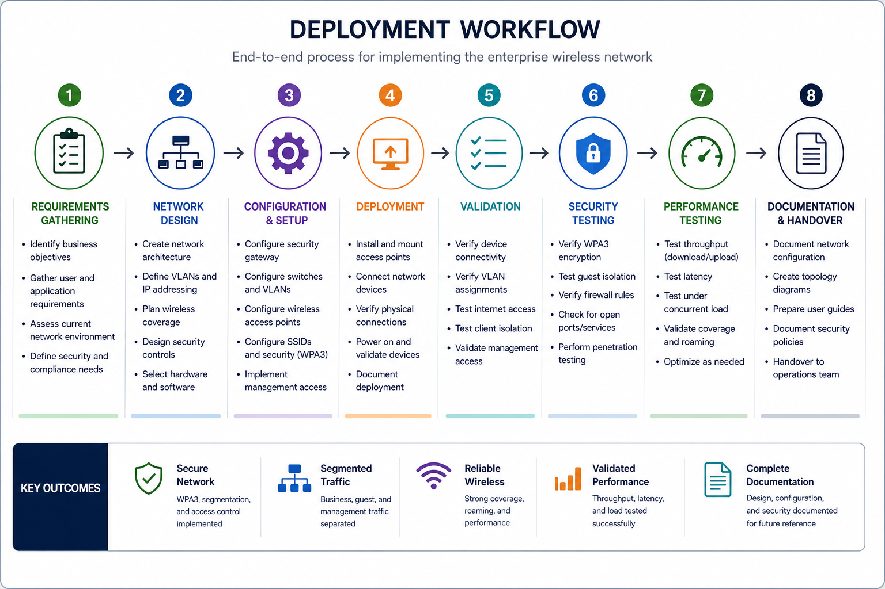
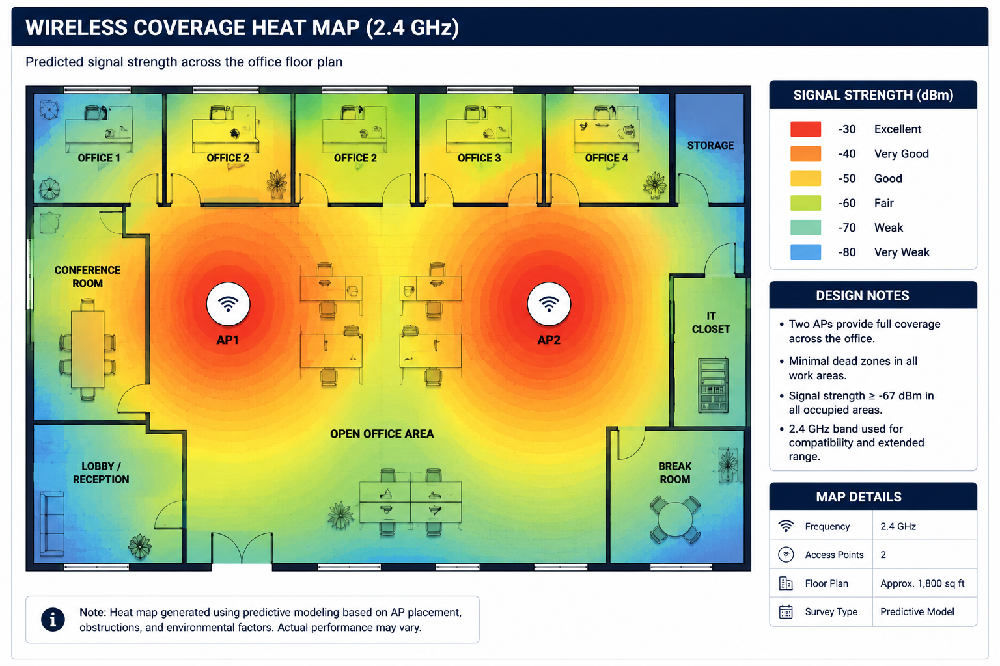

# 🌐 Enterprise Secure Wireless Network Design

> A secure enterprise wireless network architecture designed for a small business using WPA3 security, VLAN segmentation, guest network isolation, and enterprise networking best practices.

---

## 📌 Project Overview

This project demonstrates the design of a secure, scalable, enterprise-style wireless network for a small business environment.

The objective was to replace an insecure residential-grade wireless network with a professional solution emphasizing security, network segmentation, wireless performance, and long-term scalability.

The design incorporates modern enterprise networking concepts including WPA3 encryption, VLAN segmentation, dedicated management networks, enterprise wireless infrastructure, and structured deployment planning.

---

## 📄 Project Documentation

A concise professional summary of this project is available below:

📥 [Download Project Summary PDF](docs/project-summary.pdf)

---

## 🎯 Objectives

* Design a secure enterprise wireless infrastructure
* Implement WPA3-SAE wireless security
* Separate business and guest traffic using VLANs
* Isolate network management interfaces
* Improve wireless coverage and reliability
* Validate network security and performance

---

## 🧰 Network Features

* WPA3 Enterprise Wireless Security
* Guest Wi-Fi Isolation
* VLAN Segmentation
* Management VLAN
* Enterprise Access Point Deployment
* Security Gateway
* Wireless Coverage Planning
* Performance Validation
* Security Verification

---

## 🛠️ Technologies & Concepts

| Category       | Technologies                                     |
| -------------- | ------------------------------------------------ |
| Wireless       | WPA3-SAE                                         |
| Networking     | VLANs, 802.1Q, Inter-VLAN Routing                |
| Security       | Guest Isolation, Firewall Rules, Access Control  |
| Infrastructure | Enterprise Access Points, Security Gateway       |
| Validation     | Signal Heat Maps, Speed Testing, Latency Testing |
| Documentation  | Network Topology, Deployment Planning            |

---

## 🏗️ Architecture

The diagram below illustrates the overall enterprise wireless network architecture, showing how traffic flows securely from the internet through the security gateway into the managed switch before being segmented into dedicated VLANs.



---

## 🔐 Security Design

### WPA3 Authentication

The primary wireless network uses WPA3-SAE encryption to provide stronger protection against credential-based attacks and improve wireless security.

### VLAN Segmentation

Traffic is separated into dedicated VLANs to reduce attack surface, improve organization, and prevent unnecessary communication between different device groups.



| VLAN       | Purpose                    |
| ---------- | -------------------------- |
| Business   | Company devices            |
| Guest      | Internet-only guest access |
| Management | Administrative interfaces  |

### Guest Isolation

Guest users are restricted to internet access only and are prevented from communicating with internal business resources.

### Administrative Security

Management interfaces are isolated onto a dedicated management VLAN, ensuring administrative access is separated from standard user and guest traffic.

---

## 🚀 Project Workflow

The following workflow illustrates the structured deployment process used throughout the project.



1. Requirements Gathering
2. Network Design
3. Hardware Selection
4. Lab Configuration
5. Physical Deployment
6. Security Validation
7. Performance Testing
8. Documentation

---

## ✅ Validation

The network design is considered successful when it achieves the following objectives:

* WPA3 encryption enabled
* Complete Guest VLAN isolation
* Dedicated Management VLAN
* Full wireless coverage
* Stable performance under concurrent usage
* Complete deployment documentation

### 📶 Predicted Wireless Coverage

The heat map below demonstrates the expected wireless signal distribution throughout the office after optimal access point placement.



---

## 💡 Skills Demonstrated

* Enterprise Networking
* Wireless Networking
* Network Security
* VLAN Design
* WPA3 Implementation
* Infrastructure Planning
* Network Documentation
* Troubleshooting
* Performance Validation
* Network Architecture Design

---

## 📁 Repository Structure

```text
enterprise-wlan-design/
│
├── README.md
│
├── images/
│   ├── network-architecture.png
│   ├── vlan-topology.png
│   ├── deployment-workflow.png
│   └── signal-heatmap.png
│
└── docs/
    └── project-summary.pdf
```

---

## 🔮 Future Improvements

* Simulate the network using Cisco Packet Tracer or GNS3
* Add firewall rule examples
* Include DHCP scope configuration
* Add switch port configuration examples
* Expand the security hardening documentation
* Implement centralized monitoring and alerting
* Perform additional performance benchmarking

---

## 👤 Author

**Uwais Watkins**

Information Technology Professional

* GitHub: https://github.com/waisyrr
* LinkedIn: https://www.linkedin.com/in/uwais-watkins/
* Email: [uwatki1@gmail.com](mailto:uwatki1@gmail.com)
